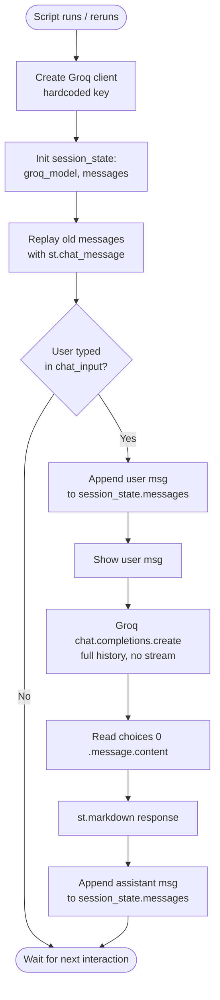

# 1_app.py: plain chat (no search, no streaming)

Pick this when: you only want to show the basic chat loop with Groq. Key is hardcoded.

```mermaid
flowchart TD
    A([Script runs / reruns]) --> B[Create Groq client<br/>hardcoded key]
    B --> C[Init session_state:<br/>groq_model, messages]
    C --> D[Replay old messages<br/>with st.chat_message]
    D --> E{User typed<br/>in chat_input?}
    E -- No --> Z([Wait for next interaction])
    E -- Yes --> F[Append user msg<br/>to session_state.messages]
    F --> G[Show user msg]
    G --> H[Groq chat.completions.create<br/>full history, no stream]
    H --> I[Read choices 0 .message.content]
    I --> J[st.markdown response]
    J --> K[Append assistant msg<br/>to session_state.messages]
    K --> Z
```
