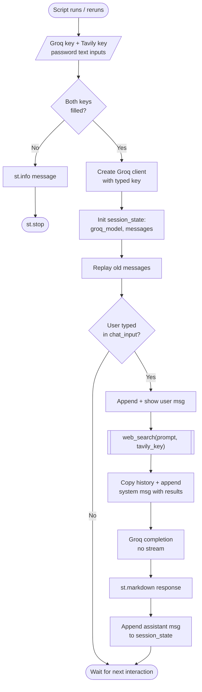

# 3_app_search_uikeys.py: search chat with keys typed in the UI

Pick this when: you want to show safe key handling (no key in code). Works, but the reply is not streamed.

```mermaid
flowchart TD
    A([Script runs / reruns]) --> B[/Groq key + Tavily key<br/>password text inputs/]
    B --> C{Both keys<br/>filled?}
    C -- No --> C1[st.info message] --> S([st.stop])
    C -- Yes --> D[Create Groq client<br/>with typed key]
    D --> E[Init session_state:<br/>groq_model, messages]
    E --> F[Replay old messages]
    F --> G{User typed<br/>in chat_input?}
    G -- No --> Z([Wait for next interaction])
    G -- Yes --> H[Append + show user msg]
    H --> I[["web_search(prompt, tavily_key)"]]
    I --> J[Copy history + append<br/>system msg with results]
    J --> K[Groq completion<br/>no stream]
    K --> L[st.markdown response]
    L --> M[Append assistant msg<br/>to session_state]
    M --> Z
```
