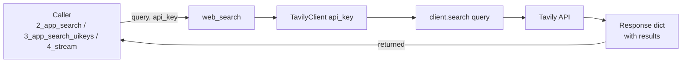

# online_search.py: Tavily search helper

Not run directly. Imported by steps 2, 3 and 4 (and test.py).

```mermaid
flowchart LR
    A[Caller<br/>2_app_search / 3_app_search_uikeys / 4_stream] -->|query, api_key| B[web_search]
    B --> C[TavilyClient api_key]
    C --> D[client.search query]
    D --> E[Tavily API]
    E --> F[Response dict<br/>with results]
    F -->|returned| A
```
